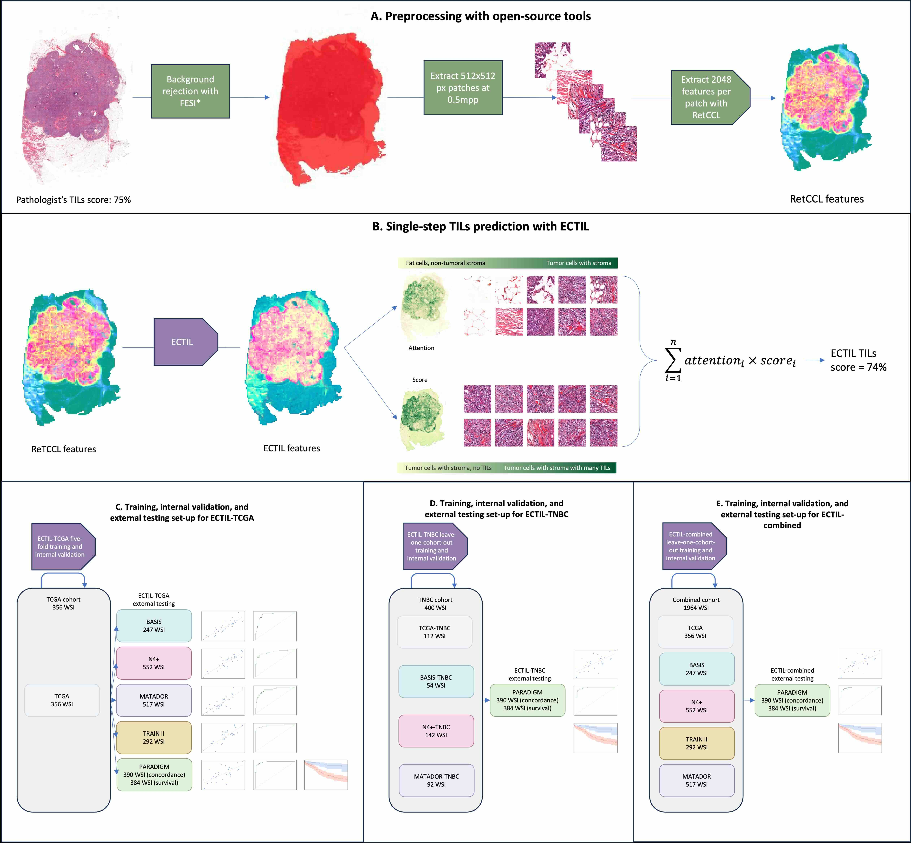

<div align="center">

# ECTIL: Label-efficient Computational stromal TIL assessment model


<a href="https://pytorch.org/get-started/locally/"></a>
<a href="https://pytorchlightning.ai/"></a>
<a href="https://hydra.cc/"></a>
<a href="https://github.com/ashleve/lightning-hydra-template"></a><br>

</div>

## Description


This is the repository with code related to the paper 

**ECTIL: Label-efficient Computational Tumour Infiltrating Lymphocyte (TIL) assessment in breast cancer: Multicentre validation in 2,340 patients with breast cancer" (publication and DOI pending)**. 

Below we show how to reproduce training, validation, and internal testing on the TCGA cohort. The trained model is available in the model zoo, and a script is available to infer the model on any WSI. Additionally, a minimal example is provided to use a pre-trained ECTIL model in your own custom pipeline. Main scripts to reproduce the analyses in the manuscript are also available.



## Main files of interest

### TILs scores
The TILs scores for TCGA samples are available under [data/clini/tcga_bc_tils.csv](data/clini/tcga_bc_tils.csv), and may be used in future research.

### Scripts for preprocessing and feature extraction
The scripts for foreground selection and tile- and feature extraction is provided, and can be run with [tools/extract/retccl/extract_retccl_tcga_bc.sh](tools/extract/retccl/extract_retccl_tcga_bc.sh)

### Using a pre-trained ECTIL model on external WSIs
- To download the pre-trained ECTIL models, read [model_zoo/ectil/tcga/readme.md](model_zoo/ectil/tcga/readme.md)
- A minimal example of running inference of a pre-trained TILs regression model on patches of a WSI is provided in [tools/infer/minimal_example.py](tools/infer/minimal_example.py), which may be adjusted for your own pipeline
- The configuration and bash scripts for running inference on a collection of WSIs for which features are extracted with [tools/extract/retccl/extract_retccl_tcga_bc.sh](tools/extract/retccl/extract_retccl_tcga_bc.sh) is available in [tools/infer/infer_tcga_retccl_external.sh](tools/infer/infer_tcga_retccl_external.sh)

### Reproducing training, validation, and testing
- The center-level folds used in the experiments presented in the paper are found in [data/clini/tcga_bc_folds.csv](data/clini/tcga_bc_folds.csv)
- The configuration and bash scripts for training, validation, and testing on TCGA is provided, and can be run with [tools/train/train_evaluate_test_tcga_retccl_internal.sh](tools/train/train_evaluate_test_tcga_retccl_internal.sh)

### Analyses
The scripts for the analyses are found in [tools/analysis](tools/analysis), which produce the main metrics and figures for the output on test folds of TCGA, found at [logs/tcga_output](logs/tcga_output)

## How to run
### Install dependencies
```bash
# clone project
git clone https://github.com/YoniSchirris/ectil
cd ectil

# [RECOMMENDED] create conda environment; this greatly simplifies installation of openslide and pixman 
conda create -n ectil python=3.10.9
conda activate ectil
pip install pip==23.3.2 # Required for older version of pytorch-lightning that was used during this project

conda install conda-forge::openslide #  Required for DLUP for loading WSIs
conda install conda-forge::pixman # Requires for DLUP for loading WSIs. Should be included in openslide
conda install conda-forge::libvips # Required for DLUP for loading WSIs

# install pytorch according to instructions
# https://pytorch.org/get-started/ # We use Stable (2.4.1+cu121) on linux for development and training on HPC)

# install requirements
python -m pip install .
python -m pip install -r requirements.txt
```

### Preprocessing: Feature extraction
Automatically perform foreground selection, extract patches, extract features with RetCCL, and save them in `h5` format. A working example is presented in [tools/extract/retccl/extract_retccl_tcga_bc.sh](tools/extract/retccl/extract_retccl_tcga_bc.sh)

To reproduce the TCGA experiments, first download the slides from the GDC repository to `/path/to/your/data/dir`, and download the RetCCL model (see [model_zoo/retccl/readme.md](model_zoo/retccl/readme.md))

E.g. extract RetCCL features from all `*.svs` files in the directory `/path/to/your/data/dir` on a small cpu with only the main thread and a relatively small batch size and write the h5 files to `/your/log/dir`.

Rename [.env.example](.env.example) to `.env` and set 
```bash
TCGA_BRCA_IMAGES_ROOT="/path/to/your/data_dir"
TCGA_BRCA_H5_ROOT_DIR="/your/log/dir" 
```

```bash
# path to data dir and log dir can also be set in the CLI of ectil
~/ectil$ python ectil/extract.py \
    experiment=ectil/extract/tcga_retccl \
    task_name=ectil_extract
    datamodule.num_workers=0 \
    datamodule.batch_size=16 \
    trainer=cpu \
    datamodule.image_root_dir='/path/to/your/data/dir' \
    datamodule.image_glob='**/*.svs' \
    model.h5_writer.h5_root_dir='/your/preferred/log/dir'
```

If a gpu is available, set `trainer=gpu`.

If `/path/to/your/dir` contains more slides than you want to extract features for, you can add 
```bash
+datamodule.image_paths_file=/path/to/file.txt
```
where `file.txt` contains, for each WSI of interest, an **absolute** path (which should be located in a subdirectory of `datamodule.image_root_dir`) on each row.

The log directory will also contain a png with a thumbnail with mask.


### Train, validation, and testing on TCGA
- Note that the first training epoch may take longer than subsequent epochs.
- As a test for reproducibility on any hardware, we noticed that on a CPU with `num_workers=0` it takes ~10 seconds per epoch of training and validation (25 epochs in ~10 minutes), which can be improved by using a GPU with more workers.
- Logs training curves on tensorboard
- Logs best metrics and hparams on mlflow

E.g. to train-validate-test on the first fold of breast cancer samples from TCGA on a cpu with no additional workers (bare minimum hardware requirements), set the `datamodule.root_dir` to the path where your `h5`s are saved (this is not static due to timestamp versioning)

```sh
python ectil/train.py \
  experiment=ectil/train/tcga/train_val.yaml \
    task_name=ectil_train_val_test \
    datamodule.num_workers=0 \
    datamodule.root_dir='/path/to/h5s/in/v/yyyy-mm-dd-ss-ms' \
    trainer=cpu
```

To view training curves, plots, and final metrics, run

```bash
tensorboard --logdir=/your/log/dir
```

and view the results in your localhost under the `scalars` and `images` tab.

Results of a hyperparameter search is better viewed through mlflow, which can be started with
```bash
mlflow ui --backend-store-uri file:///path/to/your/logs/mlflow
```

### Infer on any WSI

A minimal example to add ECTIL to your own pipeline is provided in [tools/infer/minimal_example.py](tools/infer/minimal_example.py).

An example to run inference on an `h5` of already extracted features of 1 or multiple slides is provided in [tools/infer/infer_tcga_retccl_external.sh]([tools/infer/infer_tcga_retccl_external.sh]).

First extract features from your WSIs of interest, then provide the directory and relative pathnames to these `h5` files when calling `eval.py`.

E.g., after running [tools/extract/retccl/extract_retccl_tcga_bc.sh](tools/extract/retccl/extract_retccl_tcga_bc.sh), the h5s may be saved in `~/ectil/logs/extract/1970-01-01-00-00/....`. 
```sh
cd ~/ectil/logs/extract/1970-01-01-00-00
echo "paths" > paths.csv
find * -name "*.h5" >> paths.csv
```
Now run inference with the following command (note that `~` may not always work properly, it is recommended to write out the full absolute path)
```
~/ectil$ python ectil/eval.py \
    ckpt_path=model_zoo/ectil/tcga/fold_0/epoch_065_step_858_weights_only.ckpt \
    trainer=cpu \
    datamodule.num_workers=0 \
    datamodule.root_dir=~/ectil/logs/extract/1970-01-01-00-00
    datamodule.test_paths=~/ectil/logs/extract/1970-01-01-00-00/paths.csv
```

### Analysis
The results on the 5-fold test folds on TCGA are found in [logs/tcga_output](logs/tcga_output/). To produce a calibration plot, scatter plot, and detailed metrics, run 

```sh
~/ectil$ python -m tools.analysis.calibration_curve.create_calibration_curve
~/ectil$ python -m tools.analysis.scatter_plot.create_scatter_plot
~/ectil$ python -m tools.analysis.metrics.compute_metrics
```

which will reproduce the results as presented in the manuscript on TCGA.

### Prognostic analysis
The `Rmd` script used to produce the cox regression results and the kaplan meier plots can be found under [tools/analysis/prognostic/prognostic_analysis.Rmd](tools/analysis/prognostic/prognostic_analysis.Rmd). This script is for illustration purposes only, since the raw data to produce the regressions and km plots can not be shared.


## Citation

If you use ECTIL in your research, please use the following BiBTeX entry:

```bibtex
@software{ectil,
  author = {Schirris, Y},
  month = {9},
  title = {{ECTIL: Label-efficient Computational stromal TIL assessment model}},
  url = {https://github.com/YoniSchirris/ectil},
  version = {1.0.0},
  year = {2024}
}
```

or the following plain bibliography:

```
Schirris, Y. (2024). ECTIL: Label-efficient Computational stromal TIL assessment model (Version 1.0.0) [Computer software]. https://github.com/YoniSchirris/ectil
```


