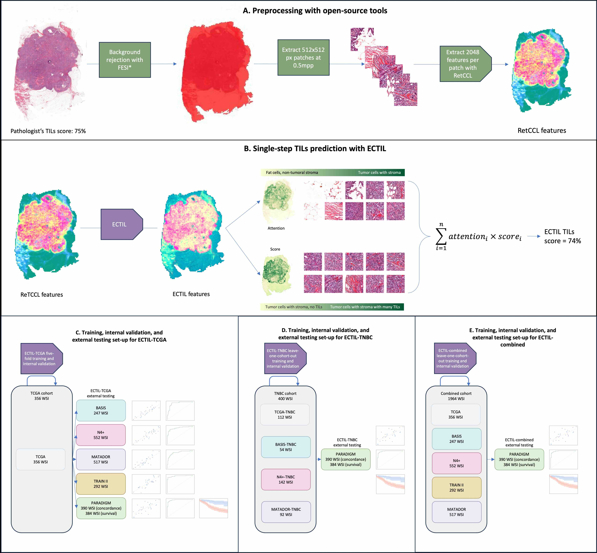

<div align="center">

# ECTIL: Label-efficient Computational stromal TIL assessment model


<a href="https://pytorch.org/get-started/locally/"></a>
<a href="https://pytorchlightning.ai/"></a>
<a href="https://hydra.cc/"></a>
<a href="https://github.com/ashleve/lightning-hydra-template"></a><br>

</div>

## Description

This is the repository with code related to the paper

**ECTIL: Label-efficient Computational Tumour Infiltrating Lymphocyte (TIL) assessment in breast cancer: Multicentre validation in 2,340 patients with breast cancer" (publication and DOI pending)**.

ECTIL scores stromal TILs directly from a breast cancer whole-slide image (WSI): tissue mask → foreground tiling → RetCCL feature extraction → ECTIL regression. The trained models are available in the [model zoo](model_zoo/ectil/tcga/readme.md). The sections below cover running inference on your own slides, integrating ECTIL into your own pipeline, and reproducing the manuscript results on the TCGA cohort.



## Quick start: infer on a WSI

The end-to-end entry point [`ectil/inference.py`](ectil/inference.py) runs the whole pipeline on a WSI (tissue mask → foreground tiling → RetCCL features → ECTIL). RetCCL is loaded automatically; you only provide the WSI and the ECTIL classifier weights. Download the weights first: [ECTIL classifier](model_zoo/ectil/tcga/readme.md) and [RetCCL encoder](model_zoo/retccl/readme.md).

### Easiest: end-to-end smoke test

[`tools/infer/run_demo.sh`](tools/infer/run_demo.sh) downloads the RetCCL and ECTIL weights and a handful of public TCGA-BRCA slides, builds the Docker image, runs both single-slide and directory inference, and checks the outputs. Run it to confirm your setup works end to end:

```bash
~/ectil$ ./tools/infer/run_demo.sh
```

### One WSI with Docker (no local Python needed)

Weights are not bundled in the image; mount them at runtime.

```bash
~/ectil$ docker build -t ectil-inference .
~/ectil$ docker run --rm \
    -v /path/to/slides:/input:ro \
    -v /path/to/weights:/weights:ro \
    -v /path/to/output:/output \
    ectil-inference \
        --wsi /input/slide.svs \
        --classifier-weights /weights/ectil_fold_0_weights_only.ckpt \
        --retccl-weights /weights/retccl_best_ckpt.pth \
        --output /output
```

Add `--gpus all` to `docker run` and `--device cuda` to the command for GPU. A runnable wrapper is provided in [`tools/infer/infer_docker.sh`](tools/infer/infer_docker.sh).

### Directly, without Docker

After [installing the dependencies](#installation):

```bash
~/ectil$ python -m ectil.inference \
    --wsi /path/to/slide.svs \
    --classifier-weights model_zoo/ectil/tcga/fold_0/epoch_065_step_858_weights_only.ckpt \
    --retccl-weights model_zoo/retccl/retccl_best_ckpt.pth \
    --output /path/to/output
```

> **Slides without an embedded spacing** (many TCGA SVS) otherwise raise `UnsupportedSlideError`. Pass `--overwrite-mpp 0.25` (the native micron-per-pixel of TCGA 40x diagnostic slides) to set the spacing explicitly.

`--wsi` accepts either a single slide or a directory of slides (recursively globbed by extension, including `.mrxs`); failed slides are skipped and recorded rather than aborting the run.

### What you get

Each run writes a timestamped directory `<output>/<run_name>/` (override the name with `--run-name`) containing a `config.json`, an aggregate `tils_scores.csv` (one row per slide, for easy analysis), and a per-slide subdir with:

- `tils_score.json` — slide-level TIL score + full config
- `tile_predictions.csv` — per-tile TIL score, attention weight, and region
- `features.h5` — the generated dataset of RetCCL features + tile metadata
- `thumbnail.png`, `mask.png`, `mask_overlay.png`
- `attention_heatmap.png`, `til_heatmap.png`

## Use a pre-trained ECTIL model in your own pipeline

A minimal, framework-agnostic example of running a pre-trained ECTIL regressor on patch features is provided in [`tools/infer/minimal_example.py`](tools/infer/minimal_example.py); adapt it to your own pipeline. To download the pre-trained models, see [`model_zoo/ectil/tcga/readme.md`](model_zoo/ectil/tcga/readme.md).

## Installation

[RECOMMENDED] Use conda — it greatly simplifies installing openslide and pixman.

```bash
# clone project
git clone https://github.com/nki-ai/ectil
cd ectil

# create conda environment
conda create -n ectil python=3.10.9
conda activate ectil
pip install pip==23.3.2  # required for the older pytorch-lightning used in this project

# system libraries required by DLUP for loading WSIs
conda install conda-forge::openslide
conda install conda-forge::pixman   # usually pulled in by openslide
conda install conda-forge::libvips

# install PyTorch per the official instructions:
# https://pytorch.org/get-started/  (we use 2.4.1+cu121 on Linux for development/training on HPC)

# install ectil and its requirements
python -m pip install .
python -m pip install -r requirements.txt
```

Docker users can skip this — the image builds the environment for you.

## Reproduce the manuscript (TCGA)

<details>
<summary><b>Data, feature extraction, training, evaluation, and analysis on the TCGA cohort</b></summary>

### Data and TILs scores

- The TILs scores for TCGA samples are in [`data/clini/tcga_bc_tils.csv`](data/clini/tcga_bc_tils.csv) and may be used in future research.
- The center-level folds used in the experiments are in [`data/clini/tcga_bc_folds.csv`](data/clini/tcga_bc_folds.csv).

### Feature extraction

Automatically perform foreground selection, extract patches, extract RetCCL features, and save them as `h5`. A working example is [`tools/extract/retccl/extract_retccl_tcga_bc.sh`](tools/extract/retccl/extract_retccl_tcga_bc.sh).

First download the slides from the GDC repository to `/path/to/your/data/dir`, and download the RetCCL model (see [`model_zoo/retccl/readme.md`](model_zoo/retccl/readme.md)).

Rename [`.env.example`](.env.example) to `.env` and set:
```bash
TCGA_BRCA_IMAGES_ROOT="/path/to/your/data_dir"
TCGA_BRCA_H5_ROOT_DIR="/your/log/dir"
```

E.g. extract RetCCL features from all `*.svs` files in a directory on a small CPU with a single worker and a relatively small batch size, writing the `h5` files to your log dir:
```bash
# paths to the data dir and log dir can also be set in the CLI
~/ectil$ python ectil/extract.py \
    experiment=ectil/extract/tcga_retccl \
    task_name=ectil_extract \
    datamodule.num_workers=0 \
    datamodule.batch_size=16 \
    trainer=cpu \
    datamodule.image_root_dir='/path/to/your/data/dir' \
    datamodule.image_glob='**/*.svs' \
    model.h5_writer.h5_root_dir='/your/preferred/log/dir'
```
Set `trainer=gpu` if a GPU is available. To extract only a subset of slides, add:
```bash
+datamodule.image_paths_file=/path/to/file.txt
```
where `file.txt` lists one **absolute** path per WSI of interest (each located under a subdirectory of `datamodule.image_root_dir`). The log directory also gets a thumbnail-with-mask PNG.

### Train, validate, and test

Notes:
- The first training epoch may take longer than subsequent ones.
- For reproducibility on any hardware: on a CPU with `num_workers=0`, ~10 s per epoch of training and validation (25 epochs in ~10 min); a GPU with more workers is faster.
- Training curves are logged to TensorBoard; best metrics and hparams to MLflow.

E.g. to train-validate-test on the first TCGA breast cancer fold on a CPU with no additional workers (bare-minimum hardware), set `datamodule.root_dir` to where your `h5`s are saved (this path is timestamp-versioned):
```bash
~/ectil$ python ectil/train.py \
    experiment=ectil/train/tcga/train_val.yaml \
    task_name=ectil_train_val_test \
    datamodule.num_workers=0 \
    datamodule.root_dir='/path/to/h5s/in/v/yyyy-mm-dd-ss-ms' \
    trainer=cpu
```
A full train-validate-test driver is in [`tools/train/train_evaluate_test_tcga_retccl_internal.sh`](tools/train/train_evaluate_test_tcga_retccl_internal.sh).

View training curves, plots, and final metrics with:
```bash
tensorboard --logdir=/your/log/dir
```
under the `scalars` and `images` tabs. Hyperparameter searches are better viewed in MLflow:
```bash
mlflow ui --backend-store-uri file:///path/to/your/logs/mlflow
```

### Infer on pre-extracted features

To run a trained ECTIL model on an `h5` of already-extracted features (1 or more slides), use [`tools/infer/infer_tcga_retccl_external.sh`](tools/infer/infer_tcga_retccl_external.sh). First extract features (above), then provide the directory and relative paths to the `h5` files when calling `eval.py`.

E.g. after running the extraction, the h5s might be saved in `~/ectil/logs/extract/1970-01-01-00-00/...`:
```bash
cd ~/ectil/logs/extract/1970-01-01-00-00
echo "paths" > paths.csv
find * -name "*.h5" >> paths.csv
```
Then run inference (write out the full absolute path; `~` may not expand correctly here):
```bash
~/ectil$ python ectil/eval.py \
    ckpt_path=model_zoo/ectil/tcga/fold_0/epoch_065_step_858_weights_only.ckpt \
    trainer=cpu \
    datamodule.num_workers=0 \
    datamodule.root_dir=~/ectil/logs/extract/1970-01-01-00-00 \
    datamodule.test_paths=~/ectil/logs/extract/1970-01-01-00-00/paths.csv
```

### Analysis

The results on the 5-fold test folds on TCGA are in [`logs/tcga_output`](logs/tcga_output/). To produce a calibration plot, scatter plot, and detailed metrics (reproducing the manuscript results on TCGA):
```bash
~/ectil$ python -m tools.analysis.calibration_curve.create_calibration_curve
~/ectil$ python -m tools.analysis.scatter_plot.create_scatter_plot
~/ectil$ python -m tools.analysis.metrics.compute_metrics
```

### Prognostic analysis

The `Rmd` script used to produce the Cox regression results and the Kaplan-Meier plots is at [`tools/analysis/prognostic/prognostic_analysis.Rmd`](tools/analysis/prognostic/prognostic_analysis.Rmd). It is for illustration purposes only, since the raw data behind the regressions and KM plots cannot be shared.

</details>

## Citation

If you use ECTIL in your research, please use the following BiBTeX entry:

```bibtex
@software{ectil,
  author = {Schirris, Y},
  month = {9},
  title = {{ECTIL: Label-efficient Computational stromal TIL assessment model}},
  url = {https://github.com/nki-ai/ectil},
  version = {1.0.0},
  year = {2024}
}
```

or the following plain bibliography:

```
Schirris, Y. (2024). ECTIL: Label-efficient Computational stromal TIL assessment model (Version 1.0.0) [Computer software]. https://github.com/nki-ai/ectil
```
